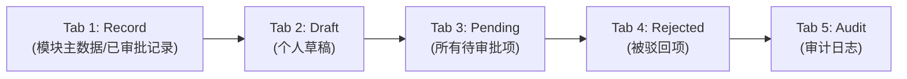
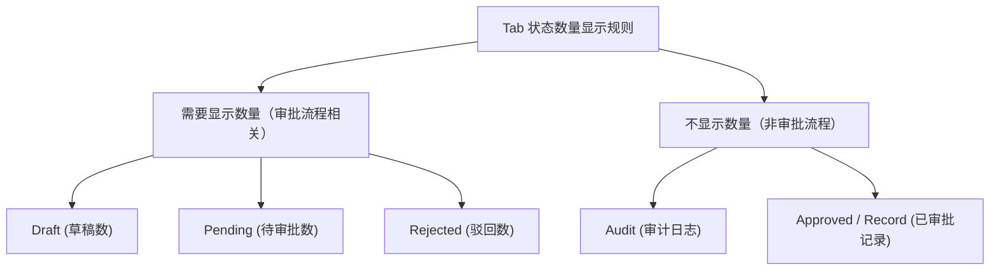

# UI Design and Consistency

> 来源：智能纪要 — 参考数据模块开发及演示事项讨论（2026年7月8日）

---

## 1. Tab 与状态标准化（Tab and Status Standardization）

### 五 Tab 结构（Five-Tab Structure）

标准化 UI 为五个 Tab，为不同模块的用户提供统一视图：

| Tab | 名称 | 说明 | 是否显示数量 |
|-----|------|------|:---:|
| 1 | Record（或模块特定名称） | 已审批通过的记录 | 否 |
| 2 | Draft | 仅显示当前用户自己的草稿，对 checker 级别不可见 | 是 |
| 3 | Pending | 显示所有待审批条目 | 是 |
| 4 | Rejected | 被驳回的条目（重新编辑场景待后续确认） | 是 |
| 5 | Audit（原名 History / Audit Log） | 审计日志，展示修改字段及完整编辑历史 | 否 |

> **命名说明：** 第一个 Tab 名称可根据模块实际业务调整（如 "Country"、"Currency" 等），但其余 Tab 名称保持一致。Audit Tab 统一命名为 **"audit"**，避免过于技术化的命名。

### 状态数量显示规则（Status Number Display）

> **原则：** 仅审批流程相关的 Tab 需要显示数量，帮助用户快速了解数据状态概览。大部分现有模块已有数量显示，但缺乏统一标准，后续需对齐。

---

## 2. 搜索功能（Search Functionality）

- 搜索功能 **非所有模块必需**，根据各模块的数据量和用户需求决定：
  - **数据量大** 的模块 → 添加搜索功能以提升用户体验
  - **数据量小** 的模块（如 Holiday 模块）→ 无需搜索功能
- 不必要的 Query Lookup 和 Current Search 功能已废弃

---

## 3. UI 风格（UI Style）

- **不强制统一 UI 风格**，因为不同用户可能有不同偏好
- 但需确保 **整体工作流（Workflow）和状态显示（Status Display）保持一致**
- 之前根据 PR Review 意见调整的 UI 效果不理想，暂不统一多样化的现有 UI 风格
- PO 和业务团队的偏好尚不明确，后续再议

---

## 4. UI 风格决策要点

- UI 风格不强制统一，因为不同用户可能有不同偏好
- **必须一致的：** 工作流（Workflow）和状态显示（Status Display）
- **可选统一的：** 搜索功能、Tab 命名细节
- PO 和业务团队的偏好尚不明确，风格层面后续再议

---

> **备注：** 本文档从 PDF 智能纪要转换而来，原始 PDF 中的设计示意图已用 Mermaid 图表重新绘制。由于原始 PDF 中的图片无法直接提取，图表为基于文字描述的重建。
